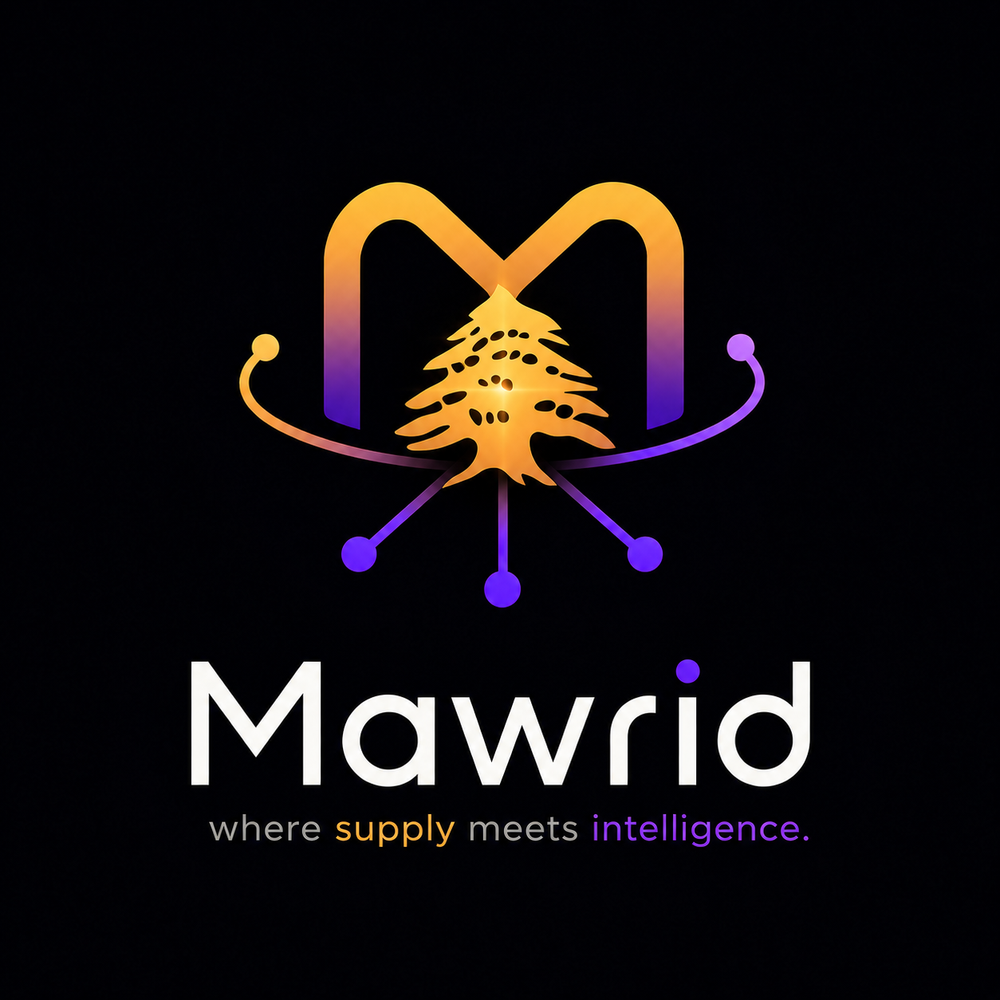

<p align="center">
  
</p>

<h1 align="center">Mawrid&nbsp;AI</h1>

<p align="center">
  <i>where supply meets intelligence</i> · <b>مورد</b>
</p>

<p align="center">
  The AI-native operating system for importers &amp; distributors — it runs the entire
  <b>import-to-collection loop</b>, from a raw supplier PDF to getting paid, with AI through every step.
</p>

<p align="center">
  
  
  
  
  
</p>

---

## What is Mawrid?

Importing today is held together with tape and stress: catalogs arrive as messy PDFs that someone
retypes by hand for days; procurement lives in an inbox and someone's head; invoices quietly go
unpaid; suppliers are chosen by guesswork. And almost none of the software was built for a region
that runs in **Arabic**, in **multiple currencies**, across the **Middle East**.

**Mawrid** is one intelligent place for the whole business — the catalog, the suppliers, the orders,
the shipments, and the money owed — that turns work which used to take **days** into **minutes**.
Every business that uses it is completely isolated from every other (multi-tenant), and **every
action that touches the outside world is approved by a human first** (HITL).

## The end-to-end loop

```
   Enrich  ─▶  Procure  ─▶  Receive  ─▶  Publish  ─▶  Collect
     ▲                                                     │
     └───────────────── one connected loop ───────────────┘
        every external action is human-approved (HITL)
```

| Stage | What happens |
|-------|--------------|
| **Enrich** | Drop a supplier PDF/Excel → autonomous workers turn it into a complete, sellable catalog (real images, specs, descriptions). |
| **Procure** | AI drafts the purchase order; you approve; it emails the supplier from **your** Gmail. |
| **Receive** | Track the container to its exact arrival time; check goods in → stock updates atomically; damage/shortage files a dispute. |
| **Publish** | Selectively publish received stock to the storefront with a retail price and a held quantity. |
| **Collect** | A 4-track dunning engine chases payment with ML-tuned tone, and stops the instant the money lands. |

## Four layers of intelligence

| Layer | In plain words | Under the hood |
|-------|----------------|----------------|
| **Machine Learning** | The instincts — learns which suppliers are reliable and what tone a reminder should take. | scikit-learn · TF-IDF+LR · DistilBERT→ONNX · Ridge regression · drift detection · **MLflow** registry |
| **Retrieval (RAG)** | The memory — ask in plain words, get the answer from *your* data, not a guess. | 6-technique pipeline on **pgvector** (HyDE · Multi-Query · RRF · cross-encoder rerank · GraphRAG · MMR) |
| **Agents** | The workers — AIs that *do* multi-step jobs on their own. | **LangGraph** supervisor + 5 specialists + MCP tool servers + Redis checkpointer |
| **AI Assistant** | The colleague — one place to talk to the whole business. | GPT-4o grounded on a live tenant snapshot (Command Center) + an advisor persona |

## Key features

- **🤖 Agentic enrichment** — drop a PDF/Excel and background workers (Redis + ARQ) carry each product through a real 5-step pipeline: extract (Docling) → research (Icecat + SearXNG + web scrape) → real image → GPT-4o specs → GPT-4o description → vector-index in pgvector. Idempotent per product, retries on failure, runs hundreds in parallel.
- **🗺️ Suppliers & verified-maker map** — a real OpenStreetMap map of curated manufacturers, your saved suppliers and discovered prospects; **ML supplier scoring** (6 features); a **discovery agent** that finds new real makers every morning.
- **✉️ Connect Gmail + email automation** — connect your own Gmail via OAuth and Mawrid sends POs / outreach / dunning **as you** (inbox, not spam). It **reads replies back**, comprehends them with GPT-4o (arrival date → shipment tracking, MOQ → supplier), and **captures emailed sheets** (Excel/PDF) straight into enrichment.
- **📦 Tracking + received goods** — container tracking down to the exact local arrival time; per-product receive checklist with atomic stock updates; damage/shortage → editable dispute letter.
- **💸 Dunning engine (4 tracks)** — B2B payables, supplier disputes, B2B receivables, B2C collections; tone (gentle/neutral/firm) chosen by a trained classifier; **atomic auto-stop** the moment an invoice is paid.
- **🧠 RAG chatbot + AI advisor** — the **Command Center** answers factual questions grounded on a live snapshot (rebuilt every message); the **Advisor** turns those facts into recommendations. Multilingual EN / FR / AR.
- **🛡️ HITL Approval Center** — every outbound message, order, dispute, and payment is queued as an editable draft; approve **(A)**, reject **(R)**, edit **(E)**; full approved/rejected history.
- **🔒 Multi-tenant isolation** — three independent layers: Postgres Row-Level Security, a `TenantRepository` filter on every query, and a tenant filter on every vector search.

## Architecture

A **modular monolith** — one FastAPI app, one Docker Compose stack, strict internal boundaries.

```
backend/app/
├── core/      # domain models + pure business logic — ZERO external deps
├── infra/     # DB, Redis, MinIO, LLM, Vault, email clients — imports core only
├── api/       # HTTP routing — calls services, no business logic
├── agents/    # LangGraph agents + MCP servers
├── ml/        # intent classifier, tone classifier, supplier scorer
└── guardrails/# Presidio PII redaction + NeMo input/output rails
```

`core/` never imports from `infra/`, `agents/`, or `api/`. External dependencies are typed with
`typing.Protocol` so they can be faked in tests. Enrichment results + embedding events are written
**atomically** via the outbox pattern (never dual-write). Breaking tenant isolation is a hard CI fail.

## Tech stack

| Area | Technologies |
|------|--------------|
| **Backend** | Python · FastAPI · SQLAlchemy (async) · Pydantic · Alembic |
| **Data** | PostgreSQL · pgvector · Redis · ARQ workers · MinIO · HashiCorp Vault |
| **AI / LLM** | OpenAI GPT-4o · text-embedding-3-small · LangGraph · LangSmith · MCP |
| **RAG** | HyDE · Multi-Query · Reciprocal Rank Fusion · cross-encoder (ms-marco-MiniLM) · GraphRAG (networkx) · MMR |
| **ML / MLOps** | scikit-learn · DistilBERT · ONNX Runtime · Ridge regression · MLflow · drift detection (PSI / chi-square / cosine) |
| **Guardrails** | Microsoft Presidio (PII EN/AR/FR) · NeMo Guardrails |
| **Ingestion** | Docling (PDF) · openpyxl (Excel) · trafilatura (web) · httpx · SearXNG · Icecat |
| **Email / Pay** | Gmail API (OAuth) · IMAP · SendGrid · Stripe · OMT · Whish · reportlab + Jinja2 (invoices) |
| **Automation** | n8n (17 workflows) |
| **Frontend** | React 18 · TypeScript · Vite · Tailwind CSS · Zustand · TanStack Query · Axios · Framer Motion · Leaflet |
| **Infra / CI** | Docker · Docker Compose · Caddy (HTTPS) · GitHub Actions · JWT (RS256) · argon2id |

## Getting started

> Prerequisites: **Docker + Docker Compose**, and [**uv**](https://github.com/astral-sh/uv) for Python. Never use pip/poetry/conda.

```bash
# 1. Bring up the full stack (Postgres+pgvector, Redis, MinIO, Vault, n8n, SearXNG, ARQ worker)
docker compose up -d

# 2. Install Python deps
uv sync

# 3. Seed secrets into Vault (dev mode is in-memory — re-run after every `docker compose down/up`)
VAULT_ADDR=http://localhost:8200 VAULT_TOKEN=root bash scripts/seed-vault.sh

# 4. Run database migrations
uv run alembic upgrade head
```

The backend, frontend, and worker run as Docker services — there is no separate `uvicorn`/`npm`
dev command outside Docker. See [SETUP.md](SETUP.md) and [docs/](docs/) for more.

## Connect Gmail — Google Cloud setup

This wires the **Connect Gmail** feature so Mawrid can, per user, **send** POs/outreach/dunning
through their own Gmail (lands in the inbox, not Junk) and **read replies back** to auto-detect,
thread and comprehend them. **No domain and no billing card are required** — Gmail API in *Testing*
mode is free. It's also available in-app at **Settings → Google Cloud Setup**.

**0. Turn on 2-Step Verification** (once, on your Google account) — *Google Account → Security → 2-Step Verification*.

**1. Create a project (no billing).** Open <https://console.cloud.google.com/projectcreate> → name it `Mawrid`, Organization *No organization* → **Create**.
> ⚠️ Ignore every "Start free / Try for free / $300 credits" banner — that's the paid trial and asks for a card. You don't need it.

**2. Enable the Gmail API.** *APIs & Services → Library* → search **Gmail API** → **Enable**.

**3. OAuth consent screen.** *APIs & Services → OAuth consent screen* → User type **External** → **Create**.
- App name `Mawrid`, support email + developer contact = yours → **Save and continue**.
- **Scopes → Add or remove scopes** → add these two, then **Update**:
  ```
  https://www.googleapis.com/auth/gmail.send
  https://www.googleapis.com/auth/gmail.readonly
  ```
- **Test users → Add users** → add every Gmail you'll send/test with (only these can connect while in Testing).
- Leave **Publishing status = Testing** — no Google review needed this way.

**4. Create the OAuth client + add the redirect URI.** *APIs & Services → Credentials → Create Credentials → OAuth client ID* → Application type **Web application**, name `Mawrid Web`. Under **Authorized redirect URIs → Add URI**, paste exactly:
```
http://localhost:8000/auth/google/callback
```
> In production also add `https://YOUR_HOST/auth/google/callback`. The path must match exactly or Google rejects sign-in. Click **Create**.

**5. Copy the Client ID & Client Secret** (re-openable any time under Credentials):
```
Client ID:     ...apps.googleusercontent.com
Client Secret: GOCSPX-...
```

**6. Seed them into Vault** (gitignored, never committed):
```
secret/mawrid/google → { client_id, client_secret }
```
Per-user Gmail **refresh tokens** (created on "Connect Gmail") are stored per-tenant, never in git.

**7. Connect.** In Mawrid → **Settings → Connect Gmail** → pick your account → allow. Emails now send **as you**, and replies are auto-detected, threaded, and comprehended (arrival date → tracking, MOQ, change requests, emailed sheets → enrichment).

**Good to know**
- In **Testing** mode, refresh tokens for an unverified app expire after **~7 days** — just click *Connect Gmail* again weekly (fine for a demo).
- Only the **test users** you added can connect until the app is verified.
- For a public launch, submit the app for **Google OAuth verification** (needs a privacy policy + verified domain) to make tokens permanent and allow any user.
- **No-OAuth fallback:** create a Gmail **App password** (Account → Security → App passwords), seed `secret/mawrid/imap → { host, user, password }`, and the IMAP poller reads your inbox in ~2 minutes (your account only).

## Development & CI gates

```bash
uv run ruff check .                          # Gate 1 — lint
uv run mypy --strict .                        # Gate 2 — types
uv run pytest backend/tests/unit/             # Gate 3 — unit tests (LLM mocked, <60s)
uv run pytest backend/tests/integration/      # Gate 4 — real DB + Redis
cd frontend && npm run typecheck              # frontend types
```

| When | Gates |
|------|-------|
| Every push | ruff + mypy · unit tests · bandit + security invariants |
| PR to master | + integration · cross-tenant red-team (15 attack vectors) · agent trajectory snapshots |
| Nightly | RAGAS eval · classifier F1 ≥ 0.85 · drift (PSI) |

## Security & secrets

All secrets come from **HashiCorp Vault** — the backend refuses to start if Vault is unreachable.
Nothing real is ever committed (`keys.txt`, `resources/`, history dumps are gitignored); `.env.example`
documents variable names only. Auth is JWT **RS256** + **argon2id**; the Connect-Gmail flow uses OAuth
(send + read scopes) and never stores a password.

## License & author

Released under the terms in [LICENSE](LICENSE). Built by **Mohamad El Jawad Mansour** — Lebanon · MENA.

<p align="center"><i>Mawrid is the future of importing.</i></p>
